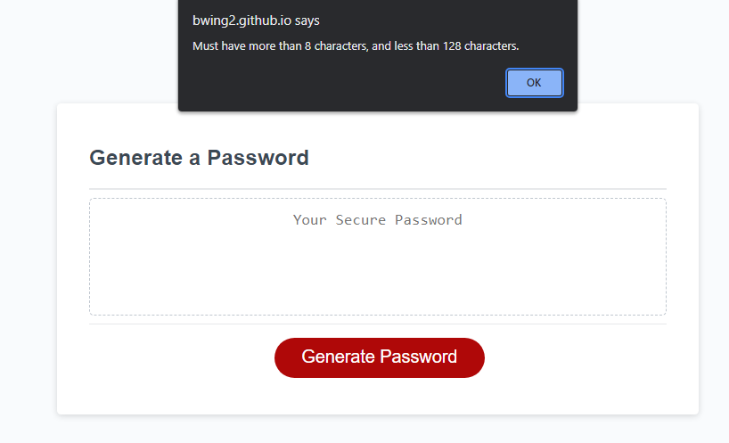

# Brandon Password Generator Challenge 3

[Live deploy link](https://bwing2.github.io/brandon-password-generator-challenge-3/)

## Description

The challenge this week was to allow users to generate random passwords, based off of prompts. These included whether or not users wanted lowercase, uppercase, symbols, and/or numbers. This is the first JavaScript project I have done, and the hardest part was figuring how to structure everything. I learned a lot about the preperation that goes into creating an outline. I also learned the importance of pseudocoding before typing any code at all.

## Installation

1. Go to repository main page.
2. Click the green `<> Code` button.
3. Click the SSH button under the Clone heading, and copy the link.
4. Open the terminal.
5. `cd` into the location you want the file to be stored.
6. type `git clone`, and then paste the URL that was copied.
7. Press enter, and you should see a message containing "Cloning into 'directory name'...",meaning you are successful.
8. Open VS Code using `code .` and the copied repository should be there.

## Usage

1. Click the `Generate Password` button.
2. User will be prompted to enter an amount of characters greater than 8 and less than 128.
3. User will be prompted whether or not they would like lowercase letters in the password.
4. User will be prompted whether or not they would like uppercase letters in the password.
5. User will be prompted whether or not they would like numbers in the password.
6. User will be prompted whether or not they would like symbols in the password.
7. Password will be generated based off the options selected in the dashed textbox.

### Password Generator Page

### Character Length for Password

### Confirm Message for Lowercase Characters

### Message if Less Than 8 or More Than 128 Characters

### Message if No Character Types are Chosen

## License 

MIT License

Copyright (c) 2023 Brandon Wing

Permission is hereby granted, free of charge, to any person obtaining a copy of this software and associated documentation files (the "Software"), to deal in the Software without restriction, including without limitation the rights to use, copy, modify, merge, publish, distribute, sublicense, and/or sell copies of the Software, and to permit persons to whom the Software is furnished to do so, subject to the following conditions:

The above copyright notice and this permission notice shall be included in all copies or substantial portions of the Software.

THE SOFTWARE IS PROVIDED "AS IS", WITHOUT WARRANTY OF ANY KIND, EXPRESS OR IMPLIED, INCLUDING BUT NOT LIMITED TO THE WARRANTIES OF MERCHANTABILITY, FITNESS FOR A PARTICULAR PURPOSE AND NONINFRINGEMENT. IN NO EVENT SHALL THE AUTHORS OR COPYRIGHT HOLDERS BE LIABLE FOR ANY CLAIM, DAMAGES OR OTHER LIABILITY, WHETHER IN AN ACTION OF CONTRACT, TORT OR OTHERWISE, ARISING FROM, OUT OF OR IN CONNECTION WITH THE SOFTWARE OR THE USE OR OTHER DEALINGS IN THE SOFTWARE.